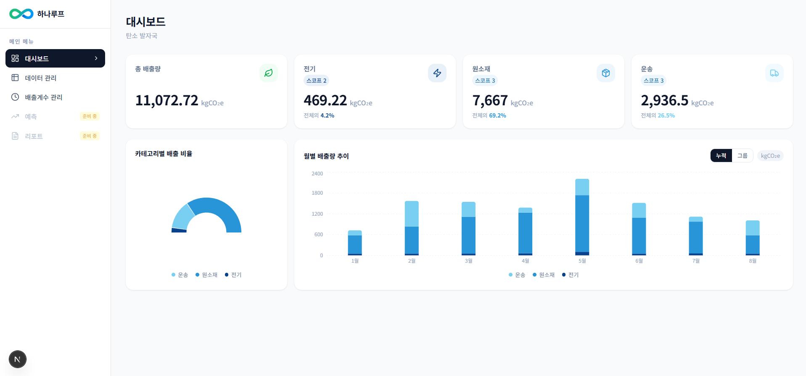
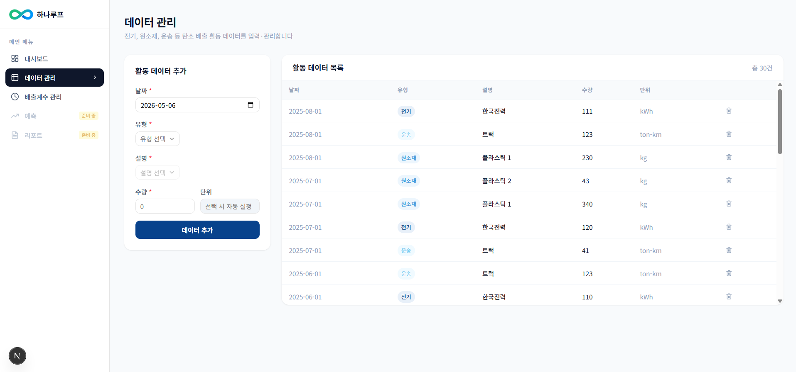
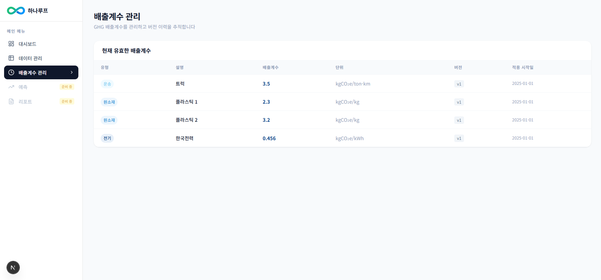
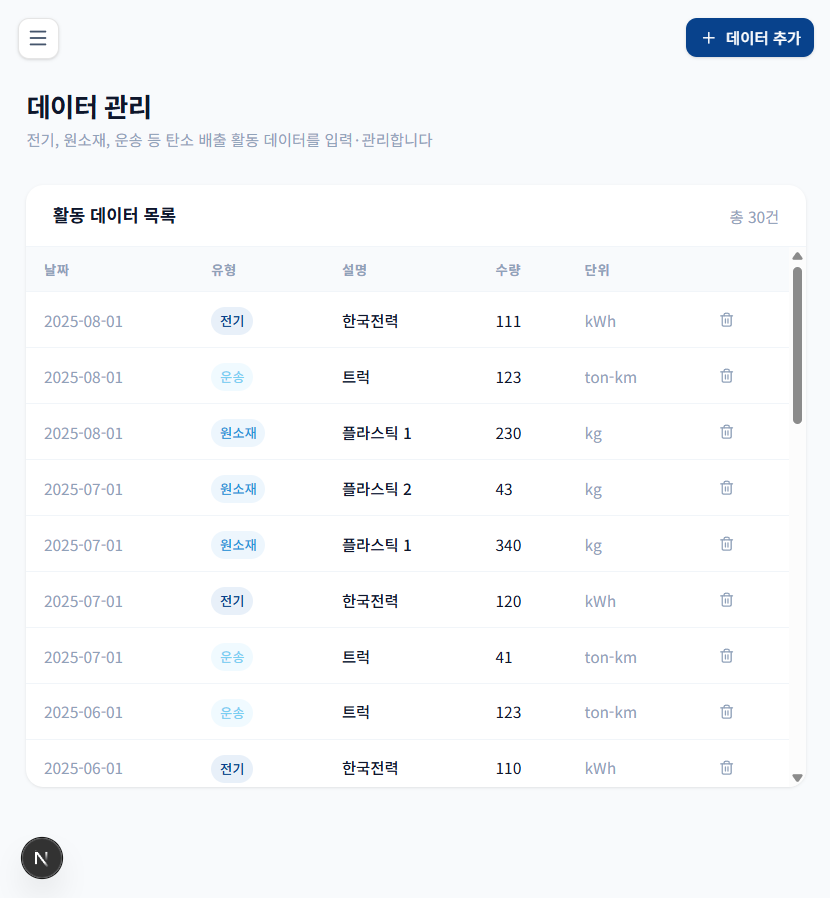
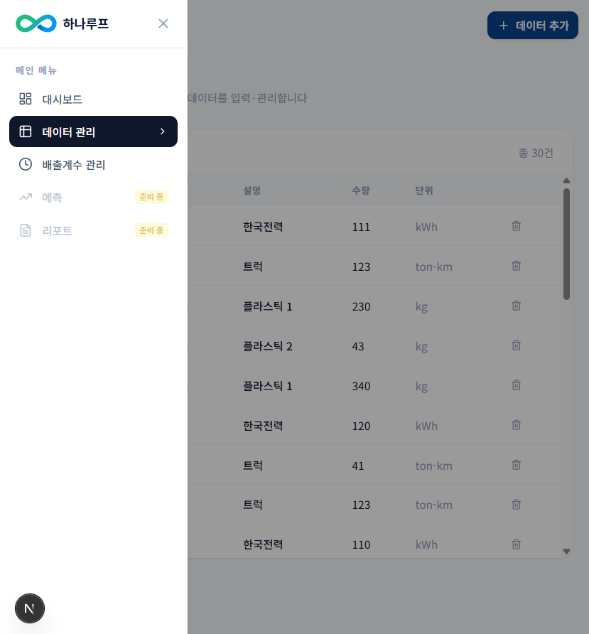

# HanaLoop PCF Dashboard

탄소 배출량을 측정하고 관리하는 SaaS 플랫폼의 프론트엔드 과제입니다.

전기, 원소재, 운송 데이터를 입력하면 GHG 배출계수를 자동으로 적용해서 제품별 탄소 발자국(PCF)을 계산하고 시각화합니다. 경영자와 실무자 모두 직관적으로 데이터를 읽을 수 있도록 대시보드를 구성했습니다.

---

## 스크린샷

### 대시보드



### 데이터 관리



### 배출계수 관리



### 에러 메시지



### 모바일



## 데모 영상

https://github.com/YOUR_USERNAME/hanaloop-dashboard/raw/main/screenshots/dashboard-demo.mp4

---

## 실행 방법

Docker만 있으면 바로 실행할 수 있습니다.

```bash
git clone https://github.com/YOUR_USERNAME/hanaloop-dashboard.git
cd hanaloop-dashboard
docker compose up --build
```

→ http://localhost:3000

DB 마이그레이션과 시드 데이터 삽입이 자동으로 이루어집니다.

### Docker 없이 로컬에서 실행하고 싶다면

```bash
# 의존성 설치
npm install

# 환경 변수 설정
cp .env.example .env.local

# PostgreSQL 실행 (Docker 필요)
docker run -d --name hanaloop_db \
  -e POSTGRES_USER=postgres \
  -e POSTGRES_PASSWORD=password \
  -e POSTGRES_DB=hanaloop_pcf \
  -p 5432:5432 \
  postgres:16-alpine

# DB 마이그레이션 + 시드 데이터
npx prisma migrate deploy && npm run db:seed

# 개발 서버 시작
npm run dev
```

→ http://localhost:3000 접속

---

## 기술 스택

최신 Next.js App Router 기반으로 구성했고, 상태 관리는 Zustand, DB는 PostgreSQL + Prisma를 사용했습니다.

| 분류          | 기술                    |
| ------------- | ----------------------- |
| Framework     | Next.js 16 (App Router) |
| Language      | TypeScript              |
| Styling       | Tailwind CSS v4         |
| UI Components | shadcn/ui               |
| State         | Zustand                 |
| DB            | PostgreSQL 16           |
| ORM           | Prisma 5                |
| Charts        | Recharts                |
| Container     | Docker Compose          |

---

## 어떻게 설계했나요?

### 레이어를 명확하게 분리했습니다

처음에는 API Route에서 직접 Prisma를 호출하는 방식으로 시작했는데, 코드가 커질수록 중복이 생기고 수정이 어려워질 것 같아서 레이어를 나눴습니다.

```
Browser
  └─ hooks/         컴포넌트와 스토어를 연결
       └─ store/    전역 상태 관리 (Zustand)
            └─ services/   API 호출 담당
                 └─ app/api/    Next.js API Routes
                      └─ lib/db/    Prisma 쿼리
                           └─ PostgreSQL
```

덕분에 API URL이 바뀌면 `services/`만, DB 쿼리가 바뀌면 `lib/db/`만 수정하면 됩니다.

### PCF는 저장하지 않고 실시간으로 계산합니다

```
CO₂e (kgCO₂e) = 활동량 × 배출계수
```

PCF 결과를 DB에 저장하면 배출계수가 변경될 때마다 모든 결과를 다시 계산해야 하는 복잡성이 생깁니다. 그래서 매 요청마다 활동 데이터와 현재 유효한 배출계수를 조합해서 실시간으로 계산하는 방식을 선택했습니다.

### GHG Scope 분류

| 유형   | Scope   | 이유                                       |
| ------ | ------- | ------------------------------------------ |
| 전기   | Scope 2 | 외부에서 구매한 전력 사용에 의한 간접 배출 |
| 원소재 | Scope 3 | 공급망 업스트림의 원자재 생산 과정         |
| 운송   | Scope 3 | 물류·운송 과정에서 발생하는 간접 배출      |

---

## ERD

```
activity_data                    emission_factors
─────────────────────            ──────────────────────────────
id          TEXT PK              id             TEXT PK
date        TIMESTAMP            type           TEXT
type        TEXT                 description    TEXT
description TEXT                 emissionFactor FLOAT
amount      FLOAT                unit           TEXT
unit        TEXT                 version        INT
createdAt   TIMESTAMP            isActive       BOOLEAN
updatedAt   TIMESTAMP            validFrom      TIMESTAMP
                                 validTo        TIMESTAMP (nullable)
                                 createdAt      TIMESTAMP
```

---

## API

| Method | URL                                 | 설명                                |
| ------ | ----------------------------------- | ----------------------------------- |
| GET    | `/api/activities`                   | 활동 데이터 목록 조회               |
| POST   | `/api/activities`                   | 활동 데이터 추가                    |
| PATCH  | `/api/activities/:id`               | 활동 데이터 수정                    |
| DELETE | `/api/activities/:id`               | 활동 데이터 삭제                    |
| GET    | `/api/emission-factors`             | 배출계수 전체 조회 (버전 이력 포함) |
| GET    | `/api/emission-factors?active=true` | 현재 유효한 배출계수만 조회         |
| GET    | `/api/pcf`                          | PCF 계산 결과 조회                  |
| GET    | `/api/pcf?format=summary`           | 대시보드 요약 데이터 조회           |

---

## 설계 Trade-off

### PCF 실시간 계산 vs 저장

PCF 결과를 DB에 미리 저장해두는 방법도 있었습니다. 하지만 그렇게 하면 배출계수가 바뀔 때마다 저장된 PCF 결과를 전부 다시 계산해서 업데이트해야 하는 문제가 생깁니다.

그래서 `pcf_results` 테이블을 만들지 않고, 매 요청마다 활동 데이터와 현재 유효한 배출계수를 가져와서 그때그때 계산하는 방식을 택했습니다.

```
GET /api/pcf 요청
      ↓
activity_data 전체 조회
      +
emission_factors (isActive=true) 조회
      ↓
generatePcfResults()로 CO₂e 계산
      ↓
결과 반환 (DB에 저장 안 함)
```

데이터가 적을 때는 문제없지만 수천 건이 넘어가면 계산 시간이 길어질 수 있습니다. 이 경우 PostgreSQL의 Materialized View나 계산 결과 캐싱 테이블을 도입해서 개선할 수 있습니다.

---

### 상태 관리 — Zustand에서 fetch까지 담당

React Query 없이 Zustand 단독으로 fetch + 캐시 + 상태 관리를 모두 처리했습니다. 구조가 단순하고 의존성이 줄어드는 장점이 있지만, 서버 상태와 클라이언트 상태가 한 곳에 섞여있다는 단점이 있습니다.

30초 캐시를 직접 구현해서 여러 페이지에서 같은 데이터를 요청해도 중복 fetch를 방지했습니다. 규모가 커지면 React Query 도입을 고려해야 합니다.

---

### 레이어 분리 — services / store / hooks

API 호출, 상태 관리, 컴포넌트 연결을 각각 분리했습니다. 지금 프로젝트 규모에서는 파일이 많아져서 오히려 복잡해 보일 수 있습니다.

하지만 API URL이 바뀌면 `services/`만, DB 쿼리가 바뀌면 `lib/db/`만 수정하면 되고, 나중에 React Query를 도입할 때도 `store/`의 fetch 로직만 걷어내면 됩니다.

---

### 차트 라이브러리 — Recharts 선택

D3.js는 커스터마이징이 자유롭지만 러닝커브가 높고, MUI Charts는 heavy library라 과제 제약에 맞지 않았습니다. Recharts는 React 친화적이고 가볍지만 복잡한 인터랙션 구현에 한계가 있습니다.

월별 차트에서 누적/그룹 바 차트를 토글로 전환하는 기능을 넣었는데, 이는 Recharts의 `stackId` prop만 제거하면 구현할 수 있어서 선택했습니다.

---

### 반응형 — 모바일 폼 토글 방식

모바일에서 폼과 테이블을 동시에 보여주면 공간이 부족합니다. 폼을 숨기고 버튼을 누르면 열리는 토글 방식을 선택했습니다.

UX가 단순해지는 장점이 있지만, 폼과 테이블을 동시에 보지 못한다는 단점이 있습니다. 태블릿 이상에서는 나란히 배치해서 이 문제를 해결했습니다.

---

### shadcn/ui 부분 도입

shadcn/ui는 컴포넌트를 직접 프로젝트에 복사해서 쓰는 방식이라 번들 크기에 영향을 최소화하면서 Select, Input 같은 접근성이 보장된 컴포넌트를 사용할 수 있었습니다.

---

## 아쉬운 점과 개선 방향

시간 제약으로 인해 구현하지 못한 부분들입니다.

- **React Query 도입**: 현재 Zustand에서 fetch + 캐시를 함께 관리하고 있는데, React Query를 도입하면 역할을 더 명확하게 분리할 수 있습니다.
- **OpenAPI / Swagger**: API 문서화가 아직 없습니다.

---

## AI 도구 사용 내역

이번 과제를 진행하면서 Claude Code를 적극적으로 활용했습니다. 단순히 작업 속도를 높이기 위한 목적이 아니라, 제한된 시간 내에 더 높은 완성도의 결과물을 만들기 위한 도구로 활용했습니다.

특히 반복적인 코드 작성이나 보일러플레이트 생성 과정에서 시간을 절약하고, 그 시간을 전체적인 구조 설계와 사용자 경험 개선에 집중하는 데 사용했습니다. 또한 코드 작성 이후에는 로직 검증이나 리팩토링 아이디어를 얻는 데에도 활용하여 코드의 안정성과 가독성을 높이고자 했습니다.

AI 도구를 사용할 때는 생성된 코드를 그대로 사용하는 것이 아니라, 항상 직접 검토하고 실행해보면서 의도한 동작과 일치하는지 확인했습니다. 이를 통해 단순한 자동 생성이 아닌, 개발 과정의 보조 도구로서 활용하는 데 집중했습니다.

결과적으로 Claude Code를 활용함으로써 개발 속도와 품질을 동시에 확보할 수 있었고, 문제 해결 과정에서도 다양한 접근 방식을 빠르게 실험해볼 수 있었습니다.

### AI로 무엇을 했나요?

- 컴포넌트 초안 생성 (SummaryCards, CategoryChart, MonthlyTrendChart 등)
- Prisma 스키마 초안 및 DB 쿼리 함수 작성
- Docker 설정 디버깅
- 반복적인 보일러플레이트 코드 작성

### 주요 프롬프트 예시

- _"Next.js App Router + Prisma + PostgreSQL 기반으로 PCF 계산 대시보드를 만들어줘. 레이어는 services / store / hooks / lib/db 로 분리해줘"_
- _"활동 데이터 입력 폼에서 유형을 선택하면 설명과 단위가 자동으로 설정되게 해줘. 그리고 필수 항목 미입력 시 에러 메시지가 표시되게 해줘"_
- _"Docker Compose로 PostgreSQL + Next.js 앱을 한 번에 실행할 수 있게 해줘. 컨테이너 시작 시 마이그레이션과 시드 데이터 삽입이 자동으로 되게 해줘"_

### 왜 이런 결정을 했나요?

AI가 제안한 코드를 그대로 쓰지 않고 직접 판단해서 수정한 부분들입니다.

**PCF 실시간 계산 방식 선택**
AI는 처음에 PCF 결과를 DB에 저장하는 방식을 제안했습니다. 하지만 배출계수가 변경될 때마다 모든 결과를 다시 계산해야 하는 복잡성을 고려해서 실시간 계산 방식으로 변경했습니다.

**레이어 분리 구조 결정**
AI가 API Route에서 Prisma를 직접 호출하는 단순한 구조를 제안했는데, 확장성을 고려해서 services / store / hooks / lib/db 로 역할을 분리하는 구조로 직접 설계했습니다.

**Zustand fetch 방식 결정**
AI가 훅에서 fetch하는 방식을 제안했지만, 여러 페이지에서 같은 데이터를 요청할 때 중복 fetch가 발생하는 문제를 고려해서 Zustand에서 fetch + 캐시를 관리하는 방식으로 변경했습니다.

**색상 테마 및 UI 디자인**
AI가 생성한 UI 초안을 기반으로 색상 테마(`#08428C`, `#2995D9`, `#79CFF2`)와 전체적인 레이아웃은 직접 결정했습니다.
